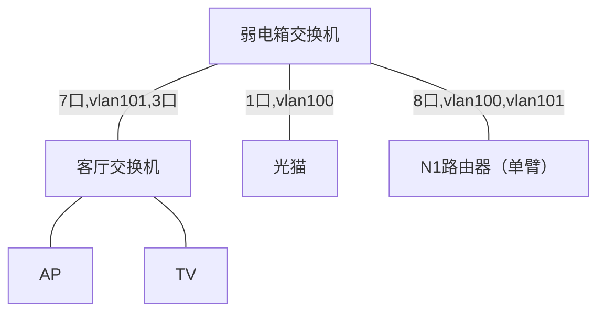

## 移动光猫 

移动光猫 LAN 192.168.113.1 

超级账号: 

USer: CMCCAdmin 

Password: aDm8H%MdA 

新密码 Rt4En9J#9

已修改为桥接模式

宽带账号13037139970，密码888888

13037139970@jtkd

## ~~极路由4~~ 

极路由4 openwrt + openclash

 admin gomi1992 

WAN-->移动光猫 192.168.113.3 LAN 192.168.199.1 

## 客厅8口vlan交换机

账号 admin 密码 gomi1992

ip1 192.168.200.2

ip2 10.18.18.251

![[Pasted image 20240121134525.png]]
1 口、2 口暂时不使用。
## 弱电箱8口vlan交换机

账号 admin 密码 gomi1992

ip1 192.168.200.3

ip2 10.18.18.251

![[Pasted image 20240121134503.png]]

## 斐讯n1

openwrt

192.168.200.1

lan eth0.101

wan eth0.100

防火墙 iptables -t nat -I POSTROUTING -o pppoe-WAN -j MASQUERADE

## tp路由器

作为ap，设置wifi，关闭dhcp，lan设置为192.168.200.5，随意一口接交换机

## 架构 

